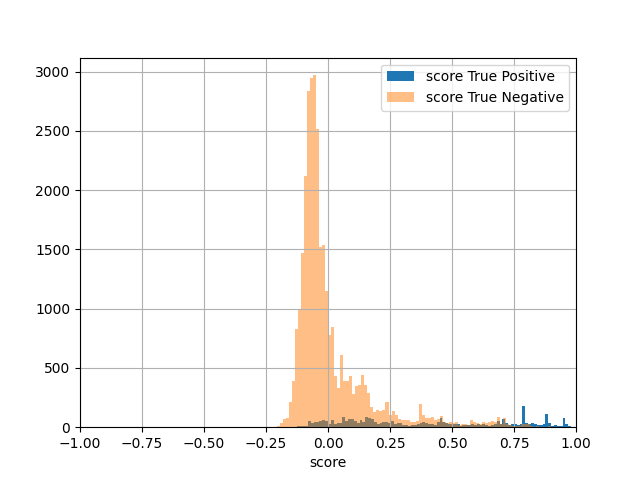
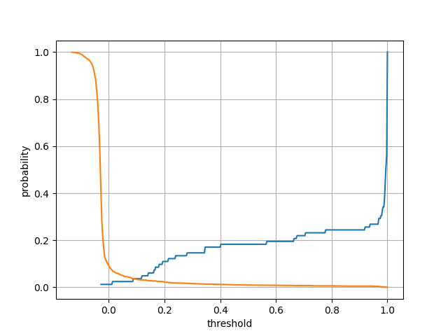
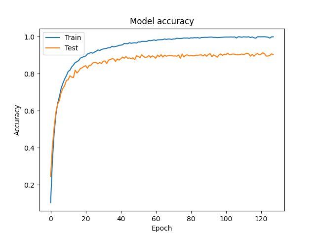
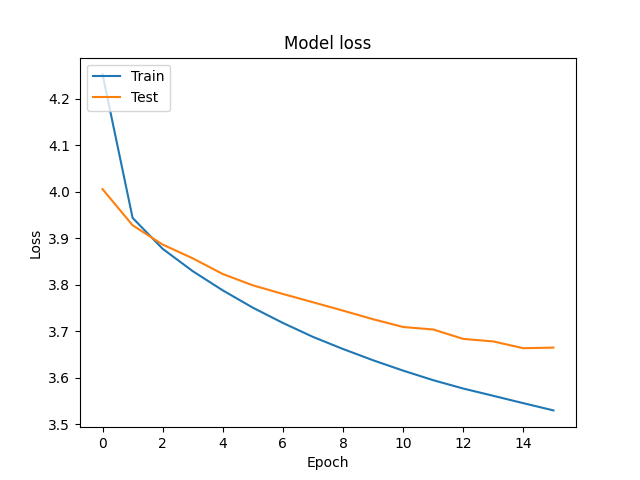

# Keystroke Authentication

This project focuses on implementing keystroke dynamics biometrics as part of the authentication process.

We use python [keyboard](https://pypi.org/project/keyboard/) / 
[pynput](https://pypi.org/project/pynput/) library to record keystrokes and 
[keras](https://keras.io/) to create and train neural network model.

Training and evaluation data is stored in separate pickle files in data folder.
This dataset was used to prepare training and evaluation data:
1. [DSL-StrongPasswordData](http://www.cs.cmu.edu/~keystroke/)

Statistics of data parameters:


Authors: 
- Grzegorz Kmita (gkmita@student.agh.edu.pl)
- Michał Moskal (mimoskal@student.agh.edu.pl)

## Install required packages

To run scripts, you need to have several packages that are not installed by default.
Install all of them at once by running this command:

```
pip3 install -r requirements.txt
```


## Creating model

In order to create model and train it with test data, run:

```
$ python3 neural_network.py
```

Model and central vector will be saved for future use in ./model directory.
Plots will be saved in ./plots directory.

Model training will look like that:


There will be 4 plots produced. Two of them are related to model training and 
two of them are related to the evaluation data. Below you can see examples of these plots:








## Registering user

A user needs to be registered in order to create their biometric template. A user needs to provide passwords 5 times.
A password must be at least 8 characters long. In fact only the first 8 characters are taken into account.

To register user run:

```
$ python3 register_user.py
```

Registration process will look like that:

```
$ username: [create your username here]
$ Sumbit your password [probes_number] times:
$ (1): [provide a password here]
$ ...
$ (probes_num): [provide a password here]
```


Passwords are not checked because the script does not read the input directly, only the time between
two consecutive keystrokes. It is possible to provide different password each time, but it will reduce the
biometric score.


## Authenticating user

Registered user can be authenticated. User needs to provide a sample that will
be transformed using neural network model into a vector. Then a similarity between 
the vector and biometric template will be calculated.

To authenticate user run:

```
$ python3 authenticate_user.py
```

Authentication process will look like that:

```
$ username: [provide the username]
$ --> [provide a password here]
```

