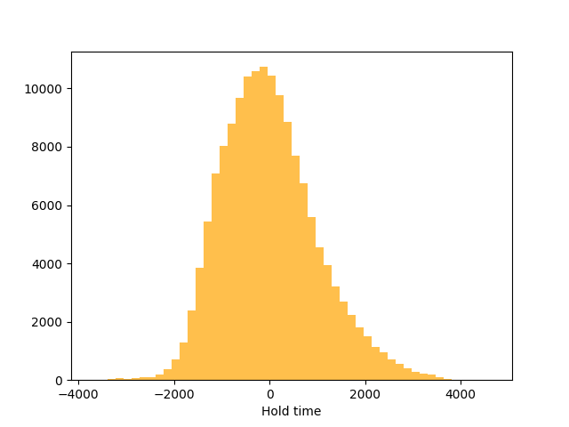
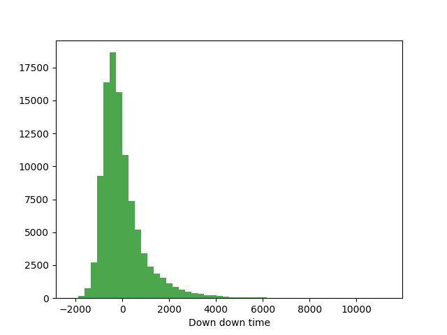
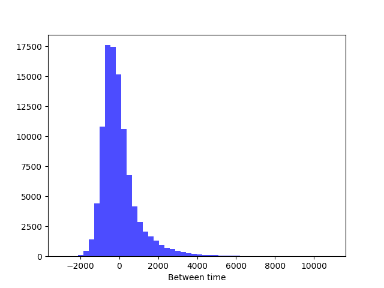

# Data folder

This folder contains files related to training and evaluation
data. Records from 51 users are extracted from the 'DSL-StrongPasswordData.csv'
and then preprocessed. Three figures are produced.

### DSL-StrongPasswordData.csv
SOURCE: http://www.cs.cmu.edu/~keystroke/

51 users typed a password '.tie5Roanl' 400 times (8 sessions for 50 times).
File contains metadata columns as:
 - subject (ID of a user)
 - sessionIndex (ID of a session)
 - rep (ID of typing in one session)

and 31 columns with data with keystrokes:
 - H time (down - up)
 - DD time (down - down)
 - UD time (up - down)

### Data preprocessing

Before splitting the data into training and evaluation datasets, 
we got rid of outlines which caused the neural network and data augmentation to
be less effective and reliable.

99% of data was kept and the rest was extracted. Then the data augmentation was performed separately on
three different parameters of the data (H, DD, UD).

### Data augmentation

StandardScaler from sklearn preprocessing was used to standardize the input data. Each of the features was treated
separately and then all three of them were merged into one array that was indexed by the 'subject' column.

### Final step

After the preprocessing and data augmentation, data was shuffled and split into training and evaluation datasets.
Then datasets were transformed into dictionaries and saved as:
 - train_user_data.pickle
 - eval_user_data.pickle

### FIGURES

Data from the training dataset was analyzed and put into three figures:

